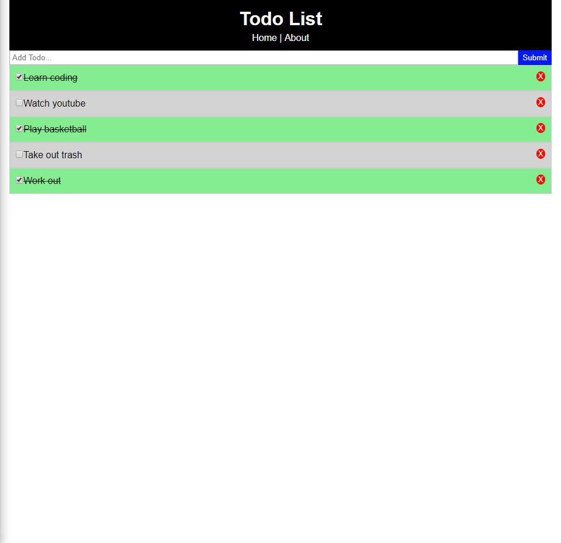

# Django-React-Exercise
A full-stack Todo List implemented with Django as the back-end and React as the front-end

To get started:
1. Go to Django main folder where the "requirements.txt" file is, "cd dj_todo"
2. Activate the virtual environment, "venv\Scripts\activate.bat"
3. Install the packages needed, "pip install -r requirements.txt"
4. Now go to Django src folder where the "manage.py" file is, "cd dj_todo\djtodo"
5. Run Django server, "python manage.py runserver"
6. On a different terminal, go to React main folder, "cd react_todo"
7. Run React server, "npm start"

A screenshot of the Todo List:

